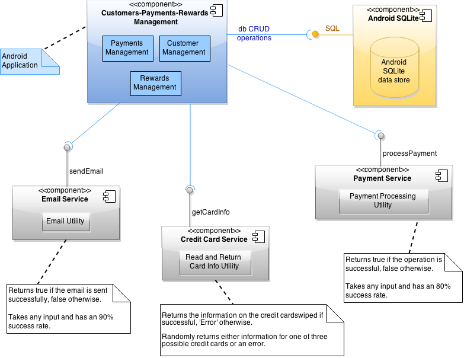
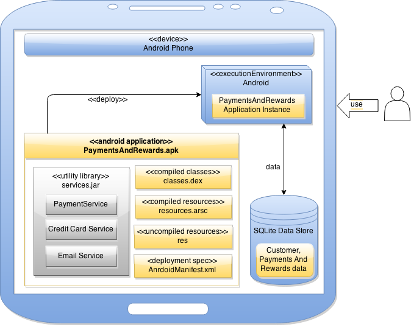
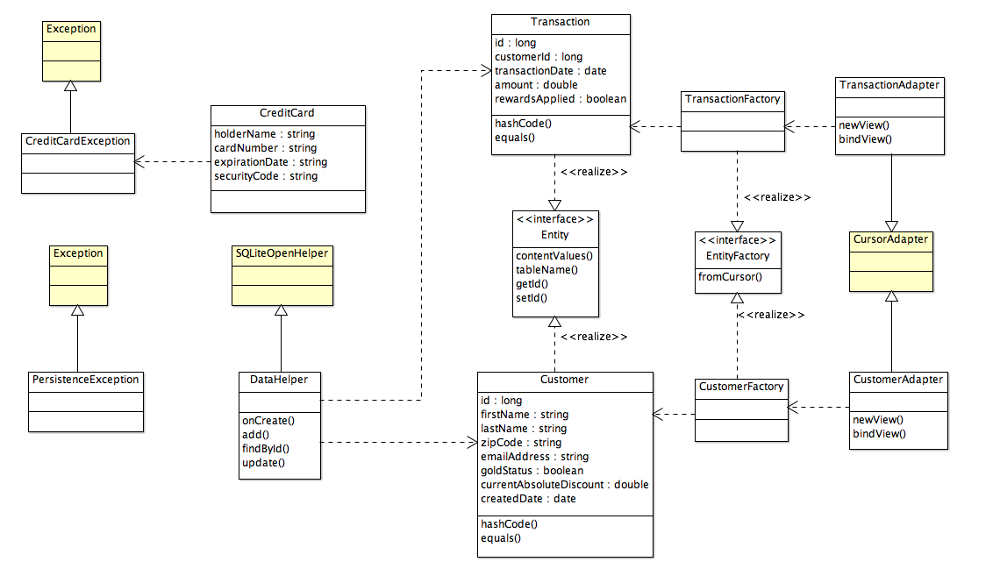
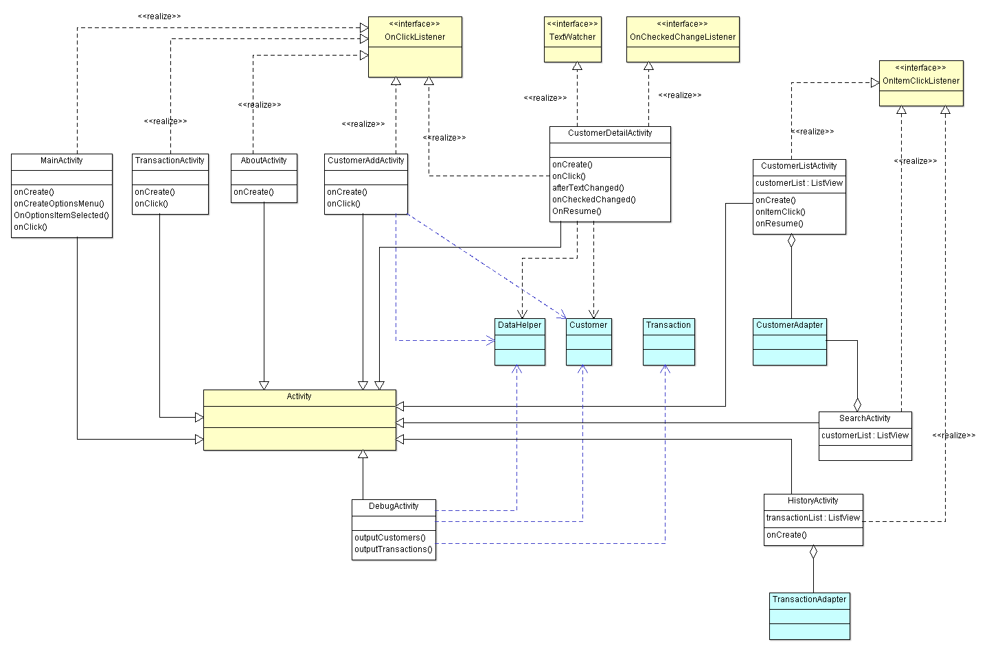

# Design Document

This document describes the architecture and design of the 'Payment and Rewards Management System for Mobile Stalls 
for Android' (PReMS) by capturing the details through UML diagrams such as component, deployment and class diagrams.
The document also captures the design constraints and assumptions.

**Author**: **Team26**

## 1 Design Considerations

### 1.1 Assumptions

- It is assumed that the stall manager has an Android device to use the PReMS application
- Assumption is that the stall manager user is familiar with the Android OS and in using Android apps
- It is assumed that the end user is aware of the complete set of requirements
- Library classes such as Date or Currency  are not shown in the design. More preference is given to the usage
of standard Java library classes instead of custom implementations
- This design document does not document the screen shots used. The user interface cartoons are captured as part
of the user manual
- No automated test cases are implemented or code coverage is checked. Manual testing is conducted and only if
time permits, automated testing is planned

### 1.2 Constraints

- This system is only supported for Android phones/tablets and the user interface is optimized for Android phones
- External libraries are used for `Credit Card Reading`, `Credit Card Payment Processing` and for `Sending Emails`. 
All these three services are part of the external library - `services.jar`
	- The `Credit Card Reading` service is implemented in the library so that it randomly returns either information
	for one of the three possible credit cards or an error
    - The `Credit Card Payment Processing` service is implemented in the library so that it takes any input and has 
    80% success rate
    - The `Sending Emails` service is implemented in the library so that it takes any input and has a 90% success
    rate 
- The credit card information stored for each user as part of transaction history. However, the credit card details
are not fetched for a new transaction. Each time, the credit card information is newly read

### 1.3 System Environment

- Eclipse IDE with an android simulator/android device is used to develop and test the application
- Eclipse Kepler or above is used for application development and JDK 1.6 or above is used
- The Payment and Rewards Management Android application is targeted for Android SDK version-19 and the minimum
version it supports is SDK-16
- Android libraries that are installed on top of Eclipse are used for application development

A list of all software tools used in the project is mentioned below

| Tool Name                        | Purpose                                    | 
| -------------------------------- | ------------------------------------------ |
| MarkdownPad (markdown format)    | Documentation                              |
| ArgoUML                          | Application Architecture & Design          |
| www.draw.io                      | Application Architecture & Design          |
| Eclipse IDE + JDK + Android SDK  | Application Development                    |
| Android simulator / device       | Application Development & Testing          |
| JUnit                            | Application Testing                        |
| Jenkins                          | Application Build & Continuous Integration |
| Github                           | Source Control Repository                  |
| www.slack.com                    | Team collaboration                         |
| Google Hangout & Gmail           | Team collaboration

## 2 Architectural Design

The architecture provides a high-level design view of the system and the detailed design provides the component details
and their interactions.

### 2.1 Component Diagram

A high level application component diagram is given below that shows the various application components, their interfaces
and the interaction between them.

The complexities regarding `E-Mail service`, `Credit card scanner` and `Payment-Processing Provider` services are 
hidden as they are not explicitly implemented in this system and they are part of the `services.jar` library. For data
persistence/storage, Android provided SQLite data store is used.

### 2.2 Deployment Diagram

A deployment diagram that indicates the deployment location of the various application components, packages & libraries
is given below.

## 3 Low-Level Design

The main components associated with the application are described below

- Customer, Transaction, CreditCard and Activity classes
	- Two class diagrams are specified in section 3.1 and 3.2 that describes the individual entities, attributes, methods
	and their relationships.
- E-Mail service
	- The email service utility class is used to encapsulate the functionality of sending emails.
	- The actual implementation details are hidden and are part of the externally provided `services.jar` library
	- The attributes needed for sending an email includes `recepient-id`, `subject` and `body`
	- After the email is sent a boolean TRUE/FALSE is returned indicating whether the email was sent successfully or not
- Credit Card Scanner service
	- This component is not elaborated as it is available in the externally provided `services.jar` library
	- The external service returns the `card holder name`, `credit card number`, `expiration date` and `security
	code` after scanning the credit card
- Payment Processing Provider service
	- This component is also not elaborated as it is part of the external `services.jar` library
	- This service processes the payment on the credit card for the specified amount and returns a boolean TRUE/FALSE 
	based on the success/failure of completing the credit card transaction.
- Note : Data architecture (E-R diagrams, SQL Lite details) is not described in detail. The Android SQLite data store is
used to stored the customer and rewards information captured within the application

### 3.1 Class Diagram for Entities

This class diagram captures the entities and attributes that relate to the requirements; such as Customers, Payments, 
Rewards, CreditCard etc. The factory method implementation details are also captured in this class diagram. This diagram 
will be updated as and when the application is implemented to keep it up to date. Integration features such as email,
payment processing and credit card processing available with services.jar library are not shown in this version of the 
class diagram; however it will be add to the next version of this class diagram.

- Android SDK classes are represented in Yellow color
- The `Customer Management` and `Payments Management` classes are implemented to separate the complex functionalities 
(separation of concern)
- The processed discounts are tied to transactions
- Individual customer discounts (absolute and gold-status) are tied to the customer entity
- Factory design pattern is used to instantiate entities
- Android SQLite database is used to store data and the relevant APIs are used
- DataHelper and Adapter classes are used to encapsulate the entities which are used in the UI / Activity classes

### 3.2 Class Diagram for Activities

This class diagram captures the various activities that are implemented as part of the application. The activities 
correspond to the user interfaces implemented within the application.

- Android SDK classes are represented in Yellow color
- Entity level classes (from section 3.1) are represented in Blue color
- The state change from each activity to another activity is not explicitly evident from this class diagram and those 
details are captured in the user manual document
   
