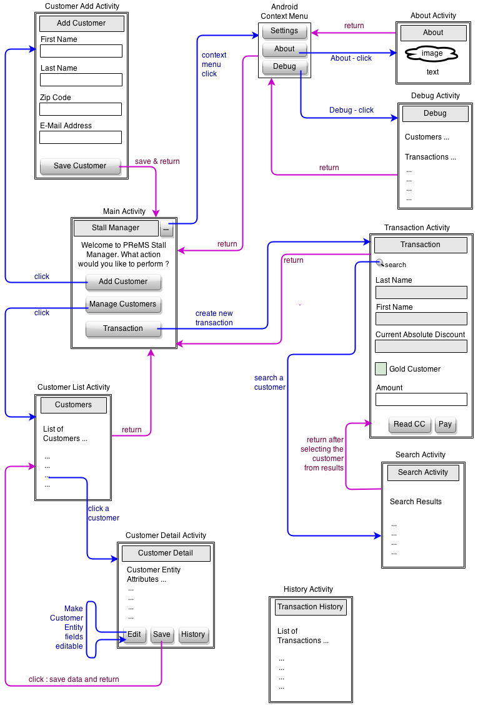

# ** Payment and rewards Management System (PReMS) User Manual **

**Author**: **Team26**

##1 Overview

Payment and rewards management system (PReMS) is an Android application that will allow farmers to manage payments and rewards for 
their customers. PReMS can be used on Android devices to add/edit customers, process payments, track transaction history, and send 
rewards' related emails.

The application integrates with other Android utility components (credit-card scanning, payment processing, and email management) to 
offer payment and rewards management features. The application will store customer information and track transactions to help the 
stall managers reward their loyal customers. 

##2 System Prerequisites

- Android Device (Phone/Tablet) running Android Kitkat or later
- The PReMS application is targeted for API version-19 and tested for a minimum of API version-16
- The PReMS application is installed on the Android device and has permissions to run and store data within the device

##3 System Capabilities

PReMS application includes the following capabilities or features

- Customer Management
	- Add/edit customer accounts
	- Manage existing customer information
	- Update customer status and their transaction history
- Processing customer payments and calculate the discounts
	- For every $100 purchase for a customer, there is a $10 reward
	- If the calender year purchases for a customer exceeds $1000, a 5% non-expirable discount is applied for all future 
	transactions. This 5% discount is applied before applying any other discounts
- Reading and storing credit card information of a customer
- Connecting to a payment-processing service to perform credit card transactions for customers
- Checking the transaction history of a customer in detail
- Computing the final payment after applying discounts/rewards.
- Sending emails to customers when they reach min-purchase for gold status or for 10-dollar rewards
- Note
	- The customer and payments information is only stored on the device which contains the PReMS application
	- No automated/cloud backup is enabled. It is the user's responsibility to backup the data

###3.1 User Interfaces

The PReMS is a multi-activity Android application. The complete list of each of the user interface screens and their description 
is given below

####3.1.1 Stall Manager (primary screen)
This is the primary user interfaces or the first screen that shows up in the application. The following operations are 
supported

- Add Customer
	- Clicking on this button will navigate to the `Add Customer` user interface
- Manage Customers
	- Clicking on this button will navigate to the `Customers` user interface
- Transaction
	- Clicking on this button will navigate to the `Transaction` user interface
- Context menu
	- The following three options are available in the options/context menu of the application 
	- Settings
		- Functionality yet to be implemented.
	- About
		- Clicking on this option will navigate to the `About` screen
	- Debug
		- Clicking on this option will navigate to the `Debug` screen

####3.1.2 About
This UI gives a small description of the application and/or team info accompanied by an image and a text.

####3.1.3 Debug
This UI Provides a list of all debug log messages with respect to customer and payment transactions. This is helpful
in the troubleshooting of the application in case of errors encountered.

####3.1.4 Add Customer
This is the UI for adding a new customer. The attributes required to add a new customer are

- First Name : String
- Last Name  : String
- Zip code   : Valid Zip Code
- E-Mail address : Valid Email-Id of the form `<name>`@`<provider>`.`<domain>`
	- Ex :- team26@gmail.com
  Note : Email address validation will be part of the final release and not the alpha version.

Once the customer data is entered, the `Save` button should be clicked to save the information to the data store. Post
saving of data, the control is navigated back to the main `Stall Manager` screen. At this time the customer data is
available for future use.

####3.1.5 Customers
This UI displays a list of all customers (first and last names) saved in the data store. User can click any one of 
the customer and the control is navigated to the `Cusomter Detail` screen.

####3.1.6 Customer Detail
This UI displays all the attributes of the selected customer. The Customer attributes includes

- First Name
- Last Name
- Zip Code
- E-Mail address
- Customer has achieved Gold Status or not
- Current Absolute Discount amount

There are three operations supported in this screen

- Edit
	- Clicking on this button will make the customer attributes editable so that the user can change the customer
	peronal information. Note that the only attributes that can be modified are first name, last name, zip code and
	e-mail address
- Save
	- Post Edit, clicking on the `save` button will update the customer information and the control is navigated
	back to `Customers` screen
- History
	- Functionality yet to be implemented

####3.1.7 Transaction
This UI allows the creation and processing of a payment transaction for a customer. The workflow is as follows

- User first searches for the customer against whom the payment has to be processed. If the customer does not exist,
the user has to navigate back and first add the customer
	- The search can be done on the customer attributes `first name` or `last name` or a combination
	- Once the search is given, a `search activity` screen is displayed that lists all matching entries and post selection 
	of the customer, the customer's details are loaded along with `absolute discount` and `gold status` information 
- Post search, the `transaction amount` is entered in the text box
- Clicking on `Read CC` button will read the credit card information for the customer. The credit card information consists of
	- Name on credit card
	- Credit card number
	- Expiration date
	- Security code 
- Clicking on `Pay` button will process the transaction and the transaction history is updated for the particular customer

####3.1.8 Search Activity
This UI displays the list of customers for the matching first or last names. Clicking on one of the customer entries is allowed.
This fetches the complete customer information for the selected entity and the control moves back to `Transaction Activity` user 
interface where the complete customer information is displayed.

####3.1.9 Transaction History
Functionality yet to be implemented.

####3.1.10 User Interface State Transitions 

For easier understanding, the state transitions, interactions and operations of all the user interfaces in the application 
are shown in the below diagram.

 

##5 Troubleshooting
Any specific errors or warnings are capture in the error log and those can be viewed within the `Debug` user interface. 

Specific examples of troubleshooting scenarios will be given in the next release (final version of the app) of this document as 
this is still an Alpha release and there are known issues in the application.

###5.1 Known Issues

* Issue 2: Customer details are gone after returning from history view
* Issue 3: Transaction screen is not closed after successful payment
* Issue 6: Adding a customer leaves the user stuck in the view

##6 Technical Support

For more technical support, please get it touch with the support team. The team contacts are given below.

| Name         | Email               |
|--------------|---------------------|
| Yuchun Qin   | yqin47@gatech.edu   |
| Ganesh S     | ganesh30@gatech.edu |
| Cedric Meury | cedric@meury.com    |
| Yue Li       | liyue2011@gmail.com |
