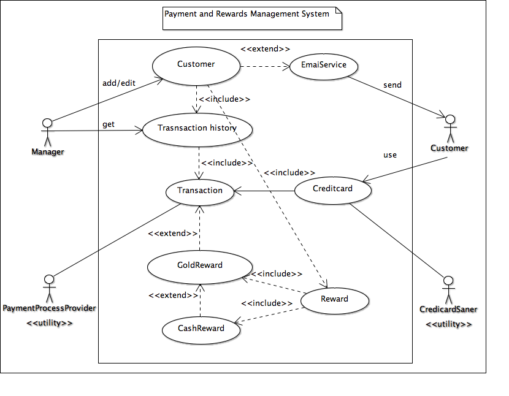

# Use Case Model

**Author**: **Team26**

## 1 Use Case Diagram

A use case diagram is given below that shows the various actors, use cases and the interaction between them.

## 2 Use Case Descriptions

Use case descriptions are given below that describe each use case' requirements, pre-conditions, post-conditions, 
and scenarios.

### `CUSTOMER Management Use-Cases`

### 2.1 UC1: ADD CUSTOMER

- Requirements: This use case allows the stall manager to add a new customer

- Pre-conditions: The application is running. Customer provided his/her personal information to the stall manager

- Post-conditions: Customer information is added to the system

- Scenarios: Stall manager gets the customer information. Stall manager adds customer info to application and saves 
the information to the data store

### 2.2 UC2: EDIT CUSTOMER

- Requirements: This use case allows the stall manager to edit a customer's account information

- Pre-conditions: The application is running. The customer information is already loaded and available. The 
customer indicates corrections/changes to his/her personal information

- Post-conditions: The customer information is updated and stored back to the data store

- Scenarios: Stall manager looks up customer information, selects the customer, edits information, and saves the
changes to the data store 

### 2.3 UC3: GET CUSTOMER

- Requirements: This use case allows the stall manager to search and get a customer's account information

- Pre-conditions: The application is running. The customer information is already in the data store. The stall
manager requests the information for a customer

- Post-conditions: The customer information is displayed

- Scenarios: Stall manager inputs the customer's first/last name, and then gets the customer's full information

### 2.4 UC4: GET TRANSACTION HISTORY

- Requirements: This use case allows the stall manager to view any customer's transaction history

- Pre-conditions: The application is running. The customer is not new. The customer information is already loaded 
and available

- Post-conditions: The transaction history for the customer is displayed on the user interface

- Scenarios: Stall manager selects a customer and selects transaction history option; The system displays a list of 
purchases with details (date, amount, whether discounts were applied and which ones)

### `Rewards related Use-Cases`

### 2.5 UC5: SEND CASH REWARD EMAIL

- Requirements: In this use case, the system sends email to customers for 10 dollars rewards

- Pre-conditions: The customer's information is in the data store. System is connected with an email service software.
A new transaction is conducted which is worth $100 or more

- Post-conditions: The $10 dollar reward is added in the customer's account for future purchases. An Email is sent to 
the customer describing the rewards information

- Scenarios: Customer spent $100 or more in a single purchase. Then the customer gets a $10 discount towards a future
purchase as a reward. System sends an email to the customer

### 2.6 UC6: SEND GOLD REWARD EMAIL

- Requirements: In this use case, the system sends email to a customer who reaches gold status

- Pre-conditions: The customer's information is in the data store. A new transaction is performed which makes the total
transaction amount for the customer per calendar year to cross $1,000. System is connected with an email service software

- Post-conditions: The customer's status updates to "Gold". System sends an email to the customer. The customer will get
a 5% discount on every future purchase

- Scenarios: Customers who spend $1,000 or more in a calendar year achieve "gold" status, which entitles them to a 5%
discount for life and on every future purchase. The change of status is effective immediately after reaching the specified
threshold

### `TRANSACTION Management Use-Cases`

### 2.7 UC7: PERFORM TRANSACTION WITHOUT REWARD

- Requirements: In this use case, system performs a transaction without any discount

- Pre-conditions: Customer buys products. The customer is not in gold status. The customer has no absolute money discount 
in the account. System is connected with credit-card scanning and payment processing software 

- Post-conditions: System processes the transaction. Transaction history is updated. The customer's calendar year
purchase amount is updated.
 
- Scenarios: Customer scans his/her credit card, and payment is completed without any discount.

### 2.8 UC8: PERFORM TRANSACTION WITH GOLD REWARD

- Requirements: In this use case, system performs a transaction with 5% Gold reward

- Pre-conditions: Customer buys products. The customer's status is gold. System is connected with credit-card scanning
and payment processing software

- Post-conditions: The 5% reward is applied in the final transaction. Transaction history is updated. The customer's
calendar year purchase amount is updated

- Scenarios: Gold customer scans his/her credit card, and payment is completed with 5% discount

### 2.9 UC9: PERFORM TRANSACTION WITH CASH REWARD

- Requirements: In this use case, system performs a transaction by applying the absolute cash reward available for 
the customer

- Pre-conditions: Customer buys products. The customer's status is not gold. The customer has cash reward in his/her
account. System is connected with credit-card scanning and payment processing software

- Post-conditions: Cash reward is applied in final transaction. Transaction history is updated. The customer's
calendar year purchase amount is updated. Money reward balance is updated

- Scenarios: Customer scans his/her credit card, and payment is completed with cash reward

### 2.10 UC10: PERFORM TRANSACTION WITH GOLD REWARD & CASH REWARD

- Requirements: In this use case, system performs a transaction with 5% gold reward and absolute cash reward

- Pre-conditions: Customer buys products. The customer's status is gold. Customer has cash reward in his/her account.
System is connected with credit-card scanning and payment processing software

- Post-conditions: 5% discount is always applied first, and then cash reward is applied in final transaction. 
Transaction history is updated. The customer's calendar year purchase amount is updated. Cash reward balance is 
updated

- Scenarios: Customer scans his/her credit card, and payment is completed with 5% discount and cash reward
