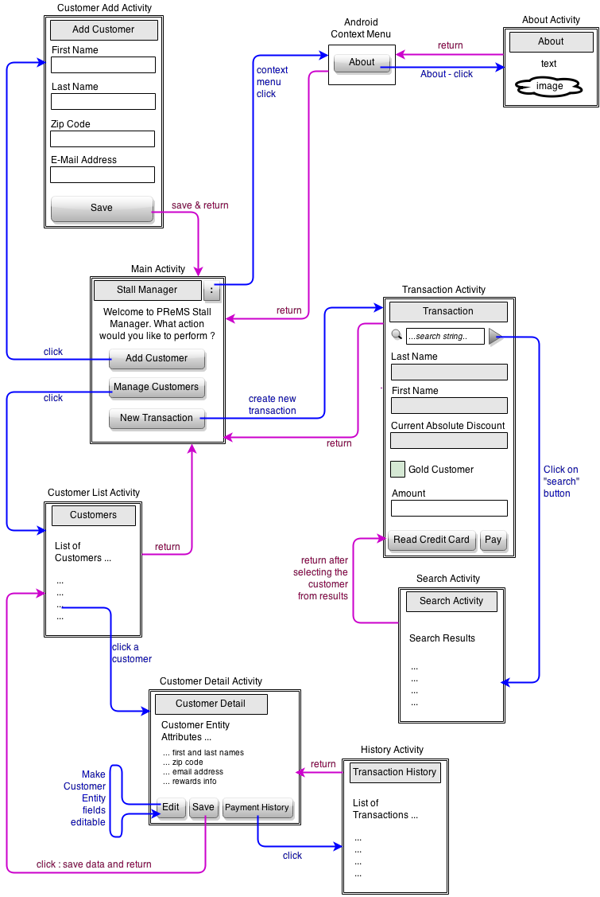

# ** Payment and rewards Management System (PReMS) User Manual **

**Author**: **Team26**

##1 Overview

Payment and rewards management system (PReMS) is an Android application that will allow farmers to manage payments and rewards for 
their customers. PReMS can be used on Android devices to add/edit customers, process payments, track transaction history, and send 
rewards' related emails.

The application integrates with other Android utility services (credit-card scanning, payment processing, and email management) to 
offer payment and rewards management features. The application will store customer information and track transactions to help the 
stall managers reward their loyal customers. 

##2 System Prerequisites

- Android Device (Phone/Tablet) running Android Kitkat or later
- The PReMS application is targeted for API version-19 and tested for a minimum of API version-16
- The PReMS application is installed on the Android device and has permissions to run and store data within the device

##3 System Capabilities

PReMS application includes the following capabilities or features

- Customer Management
	- Add/edit customer accounts
	- Update customer status and their payment/transaction history
- Process customer payments and calculate the discounts
	- For every $100 purchase for a customer, he/she earns a $10 reward
	- If the calender year purchases for a customer exceeds $1,000, a 5% non-expirable discount is applied for all future 
	transactions for that customer. This 5% discount is applied before applying any other discounts
- Read credit card information of a customer before performing a transaction
- Connect to a payment-processing service to perform credit card transactions for customers
- Compute the final payment after applying discounts/rewards.
- Send emails to customers when they reach min-purchase for gold status or for 10-dollar rewards
- Note
	- The customer and payments information is only stored on the device which contains the PReMS application
	- No automated device/remote/cloud backup is enabled. It is the user's responsibility to backup the data

###3.1 User Interfaces

PReMS is a multi-activity based Android application. The complete list of each of the user interface screens and their 
description is given below

####3.1.1 Stall Manager (primary screen)
This is the primary user interface or the first screen that shows up in the application. The following operations are 
supported in this screen

- Add Customer
	- Clicking on this button will navigate to the `Add Customer` user interface
- Manage Customers
	- Clicking on this button will navigate to the `Customers` user interface
- New Transaction
	- Clicking on this button will navigate to the `Transaction` user interface
- Context menu
	- Top right part of the UI of the application
	- The following option is available in the options/context menu of the application 
	- About
		- Clicking on this option will navigate to the `About` screen

####3.1.2 About
This UI gives the name of the application and the team members involved in the application development

####3.1.3 Add Customer
This is the UI for adding a new customer. The attributes required to add a new customer are

- First Name : String
- Last Name  : String
- Zip code   : Any aphanumeric character
- E-Mail address : Valid 
- -Id of the form `<name>`@`<provider>`.`<domain>`
	- Ex :- team26@gmail.com

Once the customer data is entered, the `Save` button should be clicked to save the information to the data store. Post
saving of data, a success message is shown and the control is navigated back to the main `Stall Manager` screen. At this 
time the customer data is available for future use.

####3.1.4 Customers
This UI displays a list of all customers (first and last names) saved in the data store. User can click any one of 
the customer and the control is navigated to the `Cusomter Detail` screen.

####3.1.5 Customer Detail
This UI displays all the attributes of the selected customer. The Customer attributes includes

- First Name
- Last Name
- Zip Code
- E-Mail address
- Current Absolute Discount amount
- Whether he/she has achieved Gold Status or not

There are three operations supported in this screen

- Edit
	- Clicking on this button will make the customer attributes editable so that the user can change the customer
	peronal information. Note that the only attributes that can be modified are first name, last name, zip code and
	e-mail address
- Save
	- Post Edit, clicking on the `save` button will update the customer information and the control is navigated
	back to `Customers` screen
- Payment History
	- Clicking on this button will navigate to the `Transaction History` user interface which shows the transaction
	history for that particular customer

####3.1.6 Transaction History
This UI displays the history of all transactions for the selected customer. The details for each transaction includes
the amount charged for that transaction after applying all discounts, the transaction date and time and all the rewards 
types applied (Cash/Gold or both).
Note that this is a read-only view. No data can be changed through this UI.

####3.1.7 Transaction
This UI allows the creation and processing of a payment transaction for a customer. The workflow is as follows

- User first searches for the customer against whom the payment has to be processed. If the customer does not exist,
the user has to navigate back and first add the customer
	- The search can be done on the customer attributes `first name` or the `last name`. Combination cannot be used 
	- The string value for the name has to be entered and the button next to it should be clicked to execute the search 
	operation
	- Once the search is given, a `search activity` screen is displayed that lists all matching entries and post selection 
	of the customer (by clicking it),  the customer's details are loaded along with `absolute discount` and `gold status` 
    information 
- Post search, the `transaction amount` has to be entered in the `Amount` text box
- Clicking on `Read Credit Card` button will read the credit card information for the customer. The credit card information 
  consists of
	- Name on credit card (Holder)
	- Credit card number
	- Expiration date
	- Security code 
- If the credit card information is not read successfully, a corresponding error message is given. The stall manager has to
click the `Read Credit Card` button again to read the credit card information 
- Clicking on `Pay` button will process the transaction and the transaction history is updated for the particular customer
- If the payment is unsuccessful, a corresponding error message is given and the transaction is not processed. The Stall 
Manager can click on `Pay` again to resubmit the payment
- Post successful payment, if there was a discount encountered ($10 for every $100 purchase, gold status for $1000 per 
calender year purchase), an email is sent to the customer indicating the reward status. And the reward status is updated to
the customer personal information. These rewards are used for future purchases.

####3.1.8 Search Activity
This UI displays the list of customers for the matching first or last name. Clicking on one of the customer entries is allowed.
This fetches the complete customer information for the selected customer and the control moves back to `Transaction` user 
interface where the complete customer information is displayed.

####3.1.9 User Interface State Transitions 

For easier understanding, the state transitions, interactions and operations of all the user interfaces in the application 
are shown in the below diagram.

 

##5 Troubleshooting
Any specific application errors or warnings are captured in the error log and those can be viewed within the Application system
logs.

For errors encountered during credit card reading/credit card transaction processing/sending email, a corresponding error message
is shown on the Android screen. So the Stall manager can re-read the credit-card/re-process the transaction. For errors during
sending of the email, the stall manager has to manually send an email as the system will not try to send the email again if there
were errors encountered during the initial send. 

##6 Technical Support

For more technical support, please get it touch with the support team. The team contacts are given below.

| Name         | Email               |
|--------------|---------------------|
| Yuchun Qin   | yqin47@gatech.edu   |
| Ganesh S     | ganesh30@gatech.edu |
| Cedric Meury | cedric@meury.com    |
| Yue Li       | liyue2011@gmail.com |

##7 Easter Egg Functionality

Go to Stall Manager -> About screen. Click on the `Cat` image a few times. Test customers are added to the database :-)
